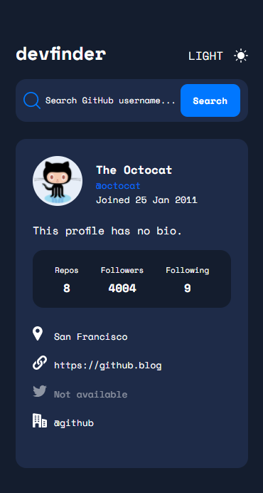
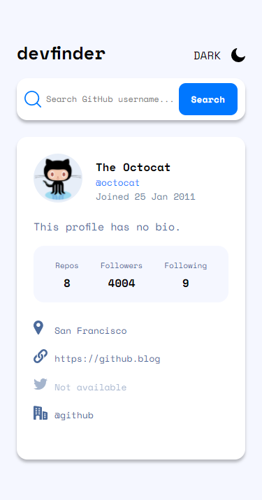
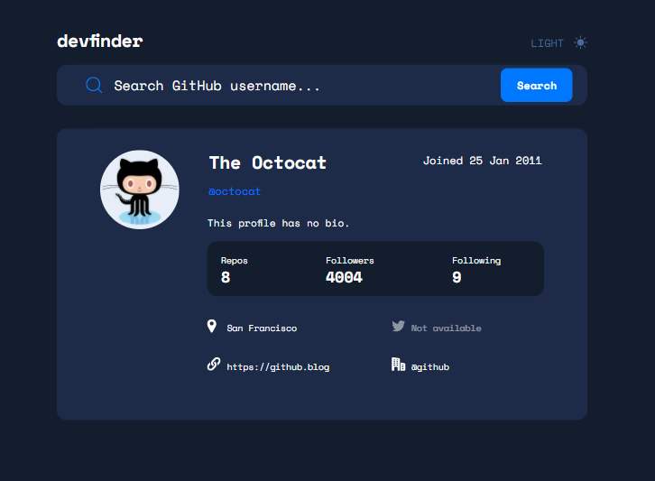
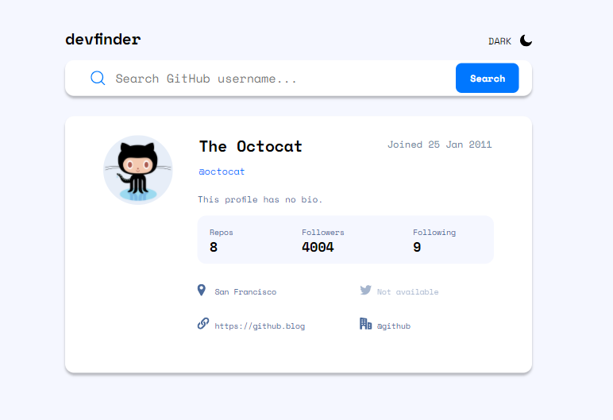

# Frontend Mentor - GitHub user search app solution

This is a solution to the [GitHub user search app challenge on Frontend Mentor](https://www.frontendmentor.io/challenges/github-user-search-app-Q09YOgaH6). Frontend Mentor challenges help you improve your coding skills by building realistic projects. 

## Table of contents

- [Overview](#overview)
  - [The challenge](#the-challenge)
  - [Screenshots](#screenshot)
  - [Links](#links)
- [How to use](#instructions)
- [My process](#my-process)
  - [Built with](#built-with)
  - [What I learned](#what-i-learned)
  - [Continued development](#continued-development)
  - [Useful resources](#useful-resources)
- [Author](#author)
- [Acknowledgments](#acknowledgments)

## Overview

### The challenge

Users should be able to:

- View the optimal layout for the app depending on their device's screen size
- See hover states for all interactive elements on the page
- Search for GitHub users by their username
- See relevant user information based on their search
- Switch between light and dark themes
- **Bonus**: Have the correct color scheme chosen for them based on their computer preferences. _Hint_: Research `prefers-color-scheme` in CSS.

### Screenshots










### Links

- Solution URL: [GitHub](https://github.com/brandonnhem/github-profile-grabber)
- Live Site URL: [Vercel](https://github-grabber.vercel.app)

## Instructions

On any web browser, visit the [live site url](https://github-grabber.vercel.app). In the search bar, type any valid GitHub username and press enter or search. If there are no results, an error message will appear in red in the search bar.

## My process

### Built with

- Semantic HTML5 markup
- CSS custom properties
- Flexbox
- CSS Grid
- Mobile-first workflow
- [Svelte](https://svelte.dev/) - JS Frontend Framework

### What I learned

**Figma**

I learned a great deal in this project. This is my first Frontend Mentor project where I am given a Figma file. The Figma file certainly helped me plan ahead on which part of the project to start and how to style each component. I learned how to use Figma as well, it is a very helpful tool for developers in constructing the design. I unfortunately learned late in to the project that you are able to get pixel perfection through looking at the inspect tab as well as setting up elements with exact pixel units.


**Svelte**

This is my second Svelte project; I am amazed at how simple and intuitive it is to use it. For a small project like this, I think it was not overkill. React brings HTML to JavaScript whereas Svelte brings JavaScript to HTML. Here's a snippet of code where I was able to fade in the theme toggle.

```html
{#if currentTheme === THEMES.LIGHT}
  <div id="light-theme-toggle" transition:fade="{{ duration: 800 }}">
    <h3>DARK</h3>
    <svg></svg>
  </div>
{:else}
  <div id="dark-theme-toggle" transition:fade="{{ duration: 800 }}">
    <h3>LIGHT</h3>
    <svg></svg>
  </div>
{/if}
```
JavaScript baked into HTML?? Crazy cool.

**CSS Grids**

I only recently discovered CSS Grids and it has certainly helped me in this project. I wanted to get the links to display in a different order when the viewport has increased, so I used CSS Grids, it made things so much easier than my old _hackier_ methods where I would use conditional statements or flatout `absolute: position`. Yikes. I'm getting better I promise.

**Flexbox**

I have gotten more familiar with flexbox and am happy that I've been using it more. Gone are the days of positioning things absolutely, that was a headache before. It also certainly helps when viewing the website with the dev tools that you can see live changes to a flex box by using the built in tools for inspecting it.

**Mobile First**

I am certainly getting better at mobile first designs. At first, I was confused at which breakpoints I should be targetting but I figured it out especially during this project.

### Continued development

In the future, I will plan out a project better in terms of styling. I was constantly rewriting the same colors over and over again. At the end of the project, I only realized that I could create variables for my styles. That would have saved me a good chunk of time. I also plan to use less of pixel units and more of rem units. I hear that it's better for accessibility reasons when increasing the size of your fonts on a system level.

Lastly, I very much would like to have started this project in TypeScript. I have seen the benefits and I think I'm ready to make the switch.

### Useful resources

- [Dark/Light Theme](https://dev.to/lenaschnedlitz/create-a-simple-dark-mode-toggle-with-svelte-4b3g) - This helped me switch between light and dark mode. Although it is geared towards Svelte, it is purely JS at the end of the day. This also helped me learn a bit more about local storage.

## Author

- GitHub - [GitHub](https://github.com/brandonnhem)
- Frontend Mentor - [@brandonnhem](https://www.frontendmentor.io/profile/brandonnhem)

## Acknowledgments

Special thanks to [Leon Michalak](https://github.com/NinjaInShade) for posting his website. I was inspired by how his theme transitioned smoothly. I changed my website directly because of how neat his looked as it went from dark to light. My version could be a _little_ better.
